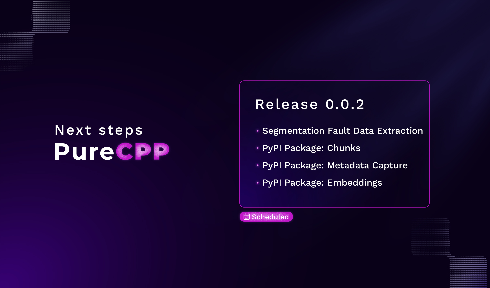

# PureCPP

[]()

**PureCPP is a powerful C++ backend architecture for RAG systems.**\
Designed for maximum performance and scalability, it integrates vector search, ONNX models, and CPU/CUDA acceleration into a seamless, Python-integrated framework.

*This repository provides detailed guidance on how to set up the environment, configure dependencies, and build the project.*

## 📚 Table of Contents
* **1.** [Environment Setup](#environment-setup)
  - [Docker](#docker)
  - [Local](#local)
* **2.** [Build](#build)
* **3.** [Using Pre-trained Models](#use-pre-trained-models)
  
---

## Project Structure

```html
├── scripts/                 # Shell utilities and setup scripts
├── package/                 # Python package
│   └── purecpp/             # Contains the compiled .so
├── libs/                    # Dependencies
├── src/                     # source files and CMake entry
│   ├── build/               # Generated build files
│   ├── Conanfile.py         # Package manager for C and C++
│   └── CMakeLists.txt       # Main build config
├── models/                  
│   ├── hf_extract_model.py
│   ├── hf_model_to_onnx.py
│   └── <Model>/
├── Dockerfile               # Build environment
└── README.md
````

### Documentation

For a detailed explanation of the features, please refer to our 🔗 [official documentation](https://docs.puredocs.org/setup).

### Contributing to PureCPP

We welcome contributions to **PureCPP**!

**If you would like to contribute, please read our 👉 [contribution guide](/community/CONTRIBUTING.md).**
  
## Quick Start with PIP

To install the package via `pip` **(for end-users)**:

```bash
pip install purecpp
```

---

## Environment Setup

---

### First of all clone the repository

```bash
git clone --recursive https://github.com/pureai-ecosystem/purecpp
cd purecpp
````

> [!WARNING]
>
> If you forgot to use `--recursive` when cloning the repository,  
> make sure to run:
>
> ```bash
> git submodule update --init --recursive
> ```

### **Docker**

---

* **1. Build a Docker image from the current directory and tag it as 'purecpp_env'**

  ```bash
  docker build -t purecpp_env .
  ```

* **2. Start a Docker container named 'env' from the 'purecpp_env' image, mounting current dir to /home**

  ```bash
  docker run -it --name env -v "$PWD":/home purecpp_env
  ```

* **3. Execute the `env_config.sh`**

  ```bash
  chmod +x scripts/*.sh
  ./scripts/env_config.sh
  ```

  *This install python essential package, libtorch, FAISS, and configure Conan*

> [!CAUTION]
>
> Once you've created the container using `docker run`, ***you don't need to recreate it again.***
> Instead, follow these two simple commands to ***reuse*** the container:
> ```bash
> docker start env
> ```
> **This command *starts an existing container* that has already been created earlier using `docker run`.**
> ```bash
> docker exec -it env bash
> ```
> **This command *attaches a terminal to the running container*, allowing you to interact with it just like you would with a regular Linux shell.**

---

### **Local**

---

> Requirements
>
> * **Python** ≥ 3.8
> * **CMake** ≥ 3.22
> * **Rust**
> * **GCC/G++** ≥ 13

#### 1. Installing dependencies

- **Ubuntu/Debian**
  ```bash
  sudo apt update && \
  sudo apt upgrade -y && \
  sudo apt install -y \
    build-essential wget curl \
    ninja-build cmake libopenblas-dev \
    libgflags-dev python3-dev libprotobuf-dev \
    protobuf-compiler unzip libssl-dev zlib1g-dev
  ```

- **Red Hat**
  ```bash
  yum update && 
  yum install -y \
        gcc gcc-c++ make git curl wget \
        ninja-build libffi-devel openssl-devel \
        protobuf-devel gflags-devel zlib-devel \
        openblas-devel unzip \
  ```

#### 2. Install Rust via rustup

```bash
curl --proto '=https' --tlsv1.2 -sSf https://sh.rustup.rs | sh -s -- -y
```
*Run rustup installer non-interactively (-y).*

```bash
source ~/.cargo/env
```
*This places cargo and rustc in /root/.cargo & activate Rust Environment*

#### 3. Execute the `env_config.sh`

  ***In case you do not have a Docker environment available, we strongly recommend that you use a Python `venv` (virtual environment) to ensure proper isolation of dependencies and reproducibility of results.***

  - Create the virtual environment (replace 'venv' with your preferred name)

    ```bash
    python3 -m venv venv
    ```

  - Activate the virtual environment on Linux or macOS
  
    ```bash
    source venv/bin/activate
    ```

  This practice minimizes conflicts between global packages and project-specific requirements. Use the steps below to create and activate the virtual environment.

```bash
chmod +x scripts/*.sh
./scripts/env_config.sh
```

*This install python essential package, libtorch, FAISS, and configure Conan*

---

## **Build**

***The `build.sh` is a development pipeline, that makes easier to compile and test***

```bash
chmod +x build.sh
./build.sh
```

- Cleans the `build/` folder
- Installs Conan dependencies if missing
- Compiles the code
- Sends the `RagPUREAI.*.so` output to[`Sandbox/`](/Sandbox)

---

## Testing Locally

The `build.sh` script will place the resulting libraries inside [`Sandbox/`](/Sandbox)

  ```html
  Sandbox/
      ├── Resources/
      ├── RagPUREAI.cpython-312-x86_64-linux-gnu.so
      └── YOUR-TEST.py
  ```

To test the Python bindings:
  ```python
  from RagPUREAI import SomeExposedFunction 
  ```

---
---

# Use pre-trained models

### 🛠️ Hugging Face to **ONNX** Converter 

These Python scripts convert Hugging Face models into the ONNX format for optimized inference.

These scripts handle two primary use cases:
1. **Feature extraction models** (e.g., `sentence-transformers`).
2. **Token classification models** (e.g., Named Entity Recognition - NER).

It automatically creates a `models` directory (in the parent folder of the script) to store the exported ONNX models and related assets.

### Requirements
  
 *Before running the script, make sure you have the following Python packages installed:*  
  ```bash
  pip install torch transformers onnx onnxruntime optimum
  ```

### Examples

```bash
python3 models/hf_model_to_onnx.py -m="dbmdz/bert-large-cased-finetuned-conll03-english" -o="bert-large-cased-finetuned-conll03-english"
```

```bash
python3 models/hf_model_to_onnx.py -m="sentence-transformers/all-MiniLM-L6-v2" -o="sentence-transformers/all-MiniLM-L6-v2"
```

### Output

```
./models/
    ├── hf_extract_model.py
    ├── hf_model_to_onnx.py
    ├── sentence-transformers/all-MiniLM-L6-v2/ 
    │    ├── model.onnx (via optimum)
    │    └── tokenizer/ 
    └── dslim/bert-base-NER/  
        ├── model.onnx  
        ├── label_map.json  
        └── tokenizer/ 
```

---
---

## Publishing to PyPI

To build and upload the Python package to PyPI:

```bash
./scripts/create_pip_package PYPI-API-KEY
```

This script will:

* Copy the `.so` file to the appropriate location.
* Package the Python module using `setuptools`.
* Upload to PyPI using `twine`.

---

## Next Steps



Stay tuned for updates and new model integrations! 🚀
