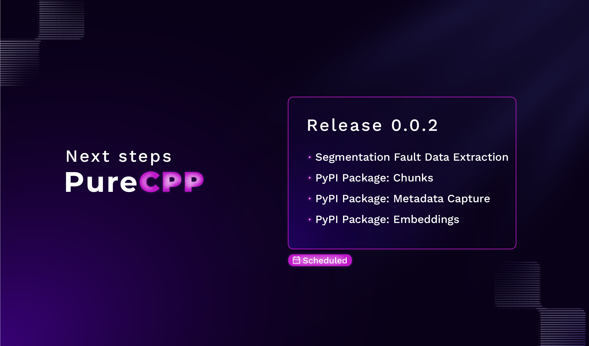

# PureCPP 

[]()

**PureCPP is a powerful C++ backend architecture for RAG systems.**\
Designed for maximum performance and scalability, it integrates vector search, ONNX models, and CPU/CUDA acceleration into a seamless, python integrated framework.\
This repository provides detailed guidance on how to set up the environment, configure dependencies with Conan, and compile the project using CMake — going beyond a simple build, it shows how to prepare a robust development pipeline.

## 📚 Table of Contents
- [1. Docker Environment Setup](#docker-environment-setup)
- [2. Local Environment Setup](#local-environment-setup)
- [3. Using Pre-trained Models](#use-pre-trained-models)
  
---


## Project Structure

```
.
├── scripts/                 # Shell utilities and setup scripts
├── package/                 # Python package
│   └── purecpp/             # Contains the compiled .so
├── libs/                    # Dependencies
├── src/                     # source files and CMake entry
    ├── build/               # Generated build files
    └── CMakeLists.txt       # Main build config
├── models/
    ├── hf_extract_model.py
    ├── hf_model_to_onnx.py
    └── <Model>.onnx
├── Dockerfile               # Build environment
└── README.md
```

## 📖 Documentation
For detailed installation and setup instructions, please refer to our official documentation:

🔗 [PureCPP Documentation](https://docs.puredocs.org/setup)


## 🚀 Contributing to PureCPP

We welcome contributions to **PureCPP**! If you would like to contribute, please read our contribution guide before opening an issue or submitting a pull request:

👉 [Contribution Guide](/community/CONTRIBUTING.md)

## Quick Start with PIP

To install the package via `pip` **(for end-users)**:

```bash
pip install purecpp
```


---
# Build Options
---

# Docker Environment Setup 

* 1. Clone the repository along with all its submodules (recursively)

```bash
git clone --recursive https://github.com/bbzaffari/purecpp
```

* 2. Navigate into the cloned repository folder

```bash
cd purecpp
```

* 3. Build a Docker image from the current directory and tag it as 'pure_faiss'

```bash
docker build -t pure_faiss .
```

* 4. Start a Docker container named 'env' from the 'pure_faiss' image, mounting current dir to /home

```bash
docker run -it --name env -v "$PWD":/home pure_faiss
```

* 5. Make all shell scripts in the scripts/ folder executable & Run the environment configuration script to set up variables, paths, or dependencies

```bash
chmod +x -R scripts/*.sh
./scripts/env_config.sh
```

* 6. Make the build.sh script executable \ and Run the 'build' command or script (ensure it's defined in PATH or as a function/alias)

```bash
chmod +x build.sh
./build.sh all
```

---

# Local Environment Setup 

### 1. Clone the Repository

```bash
git clone --recursive https://github.com/pureai-ecosystem/purecpp.git
cd purecpp
````

> **Note:**  
> If you forgot to use `--recursive` when cloning the repository,  
> make sure to run:
>
> ```bash
> git submodule update --init --recursive
> ```
>
> This will initialize and update all required Git submodules.

### 2. Installing dependencies

- **Ubuntu/Debian**
```bash
sudo apt update && \
sudo apt upgrade -y && \
sudo apt install -y \
  build-essential wget curl \
  ninja-build cmake libopenblas-dev \
  libgflags-dev python3-dev libprotobuf-dev \
  protobuf-compiler unzip libssl-dev zlib1g-dev
````
- **RedHat**
```bash
yum update && 
yum install -y \
      gcc gcc-c++ make git curl wget \
      ninja-build libffi-devel openssl-devel \
      protobuf-devel gflags-devel zlib-devel \
      openblas-devel unzip \
````

### 3. Install python essential packages

*In case you do not have a Docker environment available*, we strongly recommend that you use a Python `venv` (virtual environment) to ensure proper isolation of dependencies and reproducibility of results. This practice minimizes conflicts between global packages and project-specific requirements, fostering a cleaner and more maintainable development setup. 

Steps below to create and activate the virtual environment:

  - Create the virtual environment (replace 'venv' with your preferred name)
    ```bash
    python3 -m venv venv
    ````
  - Activate the virtual environment on Linux or macOS
    ```bash
    source venv/bin/activate
    ````

```bash
pip install build conan cmake requests pybind11
````

### 4. Execute the `env_config.sh` **(in order to install FAISS, torch, configure conan)**

```bash
chmod +x  -R ./scripts/*.sh
./scripts/env_config.sh
````

### 5. Install Rust via rustup

*Run rustup installer non-interactively (-y). This places cargo and rustc in /root/.cargo & activate Rust Environment:*
```bash
curl --proto '=https' --tlsv1.2 -sSf https://sh.rustup.rs | sh -s -- -y
source ~/.cargo/env
````

### 6. Make the build.sh script executable \ and Run the 'build' command or script (ensure it's defined in PATH or as a function/alias)

```bash
chmod +x build.sh
./build.sh all
```

---
---

## Testing Locally

> This is a development version with an automatic pipline build system. Optimizing the process, making it easy to compile and test all five modules automatically in this development version.
> To compile and build, just use the provided scripts — no manual setup needed.
> The resulting libraries will be placed inside [`Sandbox dir`](/Sandbox) 

```SourceTree
Sandbox/
├── RagPURE.cpython-312-x86_64-linux-gnu.so
└── ...
```

---

# Use pre-trained models

### 🛠️ Hugging Face to **ONNX** Converter 

This Python scripts convert Hugging Face models into the ONNX format for optimized inference.

This scripts handles two main use cases:
1. **Feature extraction models** (e.g., `sentence-transformers`).
2. **Token classification models** (e.g., Named Entity Recognition - NER).

It automatically creates a `models` directory (in the parent folder of the script) to store the exported ONNX models and related assets.

- Requirements
  
  Before running the script, make sure you have the following Python packages installed:  
  ```bash
  pip install torch transformers onnx onnxruntime optimum
  ```

## Examples

> **In ./models/ run:**


```bash
python3 models/hf_model_to_onnx.py -m="dbmdz/bert-large-cased-finetuned-conll03-english" -o="bert-large-cased-finetuned-conll03-english"
````

```bash
python3 models/hf_model_to_onnx.py -m="sentence-transformers/all-MiniLM-L6-v2" -o="sentence-transformers/all-MiniLM-L6-v2"
```

## Output

```
/models/
  ├── hf_extract_model.py
  ├── hf_model_to_onnx.py
  ├── sentence-transformers/all-MiniLM-L6-v2/ 
  │    ├── model.onnx (via optimum)
  │    └── tokenizer/ 
  └── dslim/bert-base-NER/  
       ├── model.onnx  
       ├── label_map.json  
       └── tokenizer/ 
```

---
---


## Publishing to PyPI

To build and upload the Python package:

```bash
./scripts/create_pip_package <your-pypi-api-key>
```

This script will:

* Copy the `.so` file to the appropriate location.
* Package the Python module using `setuptools`.
* Upload to PyPI using `twine`.

---

## Next Steps



Stay tuned for updates and new model integrations! 🚀
